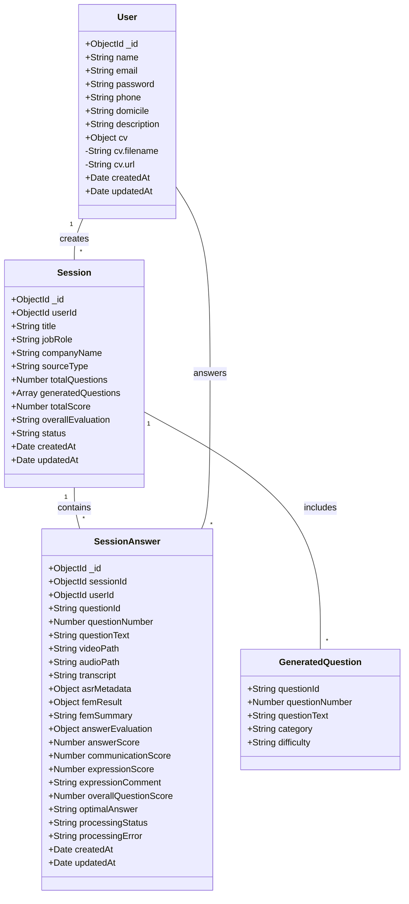
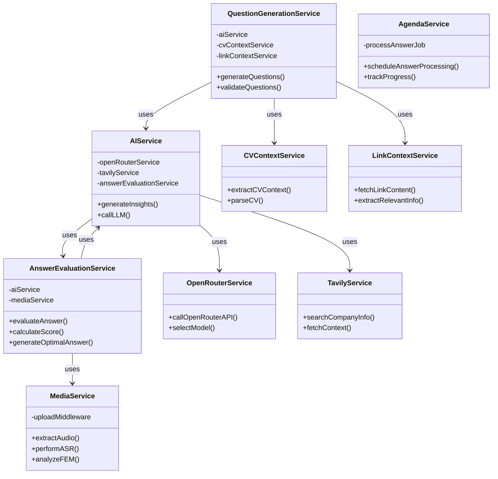
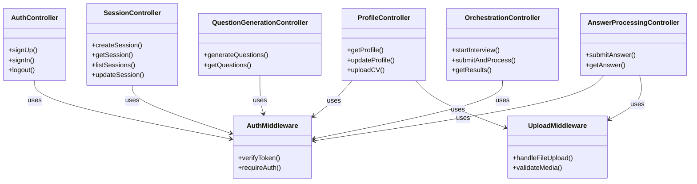
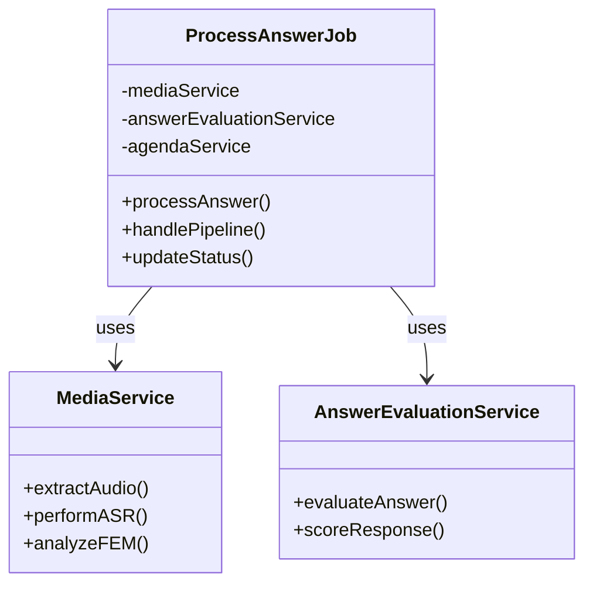
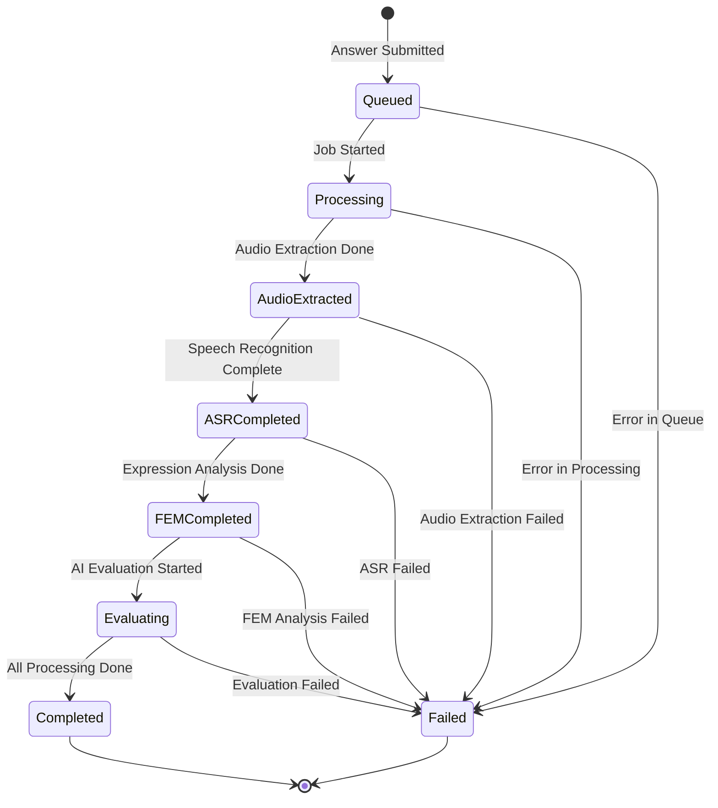
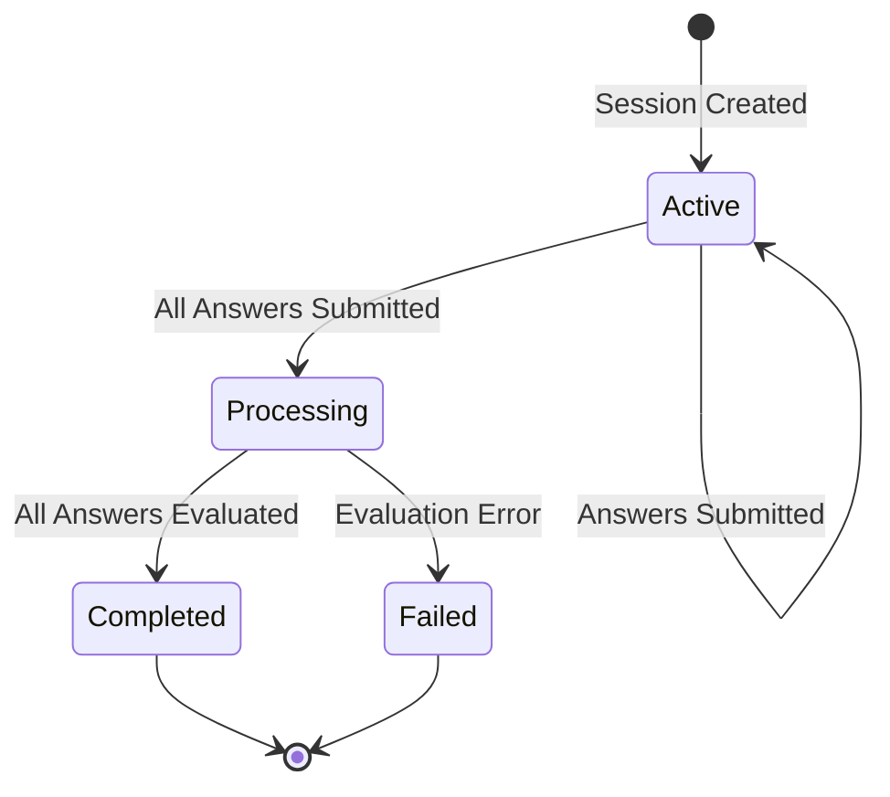
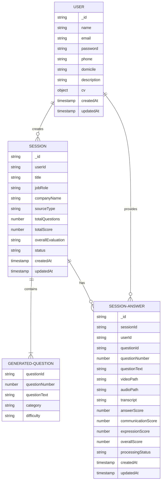

# NobiAI Class Diagram

## Database Models



## Service Layer Architecture



## Controller & Route Layer



## Data Processing Pipeline



## Processing Status Flow



## Session Lifecycle



## Entity Relationships



## Module Dependencies

```
┌─────────────────────────────────────────────┐
│           Express Server (app.js)           │
└─────────────┬───────────────────────────────┘
              │
    ┌─────────┼────────────┬──────────────┐
    │         │            │              │
┌───▼──┐  ┌──▼───┐  ┌─────▼──┐  ┌──────▼───┐
│Auth  │  │Profile│  │Session │  │Answer    │
│Routes│  │Routes │  │Routes  │  │Processing│
└───┬──┘  └──┬───┘  └──┬──────┘  │Routes    │
    │        │         │         └──┬───────┘
    │        │         │            │
┌───▼────────▼─────────▼────────────▼────┐
│        Controllers Layer                │
├─────────────────────────────────────────┤
│ AuthController                          │
│ ProfileController                       │
│ SessionController                       │
│ QuestionGenerationController            │
│ AnswerProcessingController              │
│ OrchestrationController                 │
└───┬─────────────────────────────────────┘
    │
    │ ┌──────────────────────────────────┐
    ├─┤    Services Layer                │
    │ ├──────────────────────────────────┤
    │ │ QuestionGenerationService        │
    │ │ AnswerEvaluationService          │
    │ │ MediaService                     │
    │ │ AIService                        │
    │ │ CVContextService                 │
    │ │ LinkContextService               │
    │ │ AgendaService                    │
    │ │ OpenRouterService                │
    │ │ TavilyService                    │
    │ └──────────────────────────────────┘
    │
    │ ┌──────────────────────────────────┐
    ├─┤    Jobs Layer                    │
    │ ├──────────────────────────────────┤
    │ │ ProcessAnswerJob (Agenda.js)     │
    │ └──────────────────────────────────┘
    │
    │ ┌──────────────────────────────────┐
    ├─┤    Models Layer                  │
    │ ├──────────────────────────────────┤
    │ │ User                             │
    │ │ Session                          │
    │ │ SessionAnswer                    │
    │ └──────────────────────────────────┘
    │
    └──►  MongoDB Database
```

## Key Relationships Summary

- **User** creates multiple **Sessions** for interview practice
- **Session** contains multiple **GeneratedQuestions** based on job role and CV context
- **User** provides multiple **SessionAnswers** to questions within a session
- **SessionAnswer** tracks the complete processing pipeline: video/audio → transcript → evaluation → score
- **Services** handle business logic:
  - Question generation from CV and company context
  - Media processing (video/audio extraction, ASR, FEM)
  - Answer evaluation using AI models
- **Controllers** route HTTP requests and coordinate services
- **Jobs** handle asynchronous processing of answers through the pipeline
- **Middleware** handles authentication and file uploads

## Processing Pipeline Detail

1. **User submits answer** → VideoPath, AudioPath saved
2. **ProcessAnswerJob triggered** → Status: queued
3. **Audio Extraction** → AudioPath extracted, Status: audio_extracted
4. **ASR (Speech Recognition)** → Transcript generated, Status: asr_completed
5. **FEM Analysis** → Expression analysis, Status: fem_completed
6. **Gemini Evaluation** → Score & feedback, Status: evaluating
7. **Finalization** → OptimalAnswer generated, Status: completed
8. **Session Finalization** → TotalScore calculated, OverallEvaluation generated
